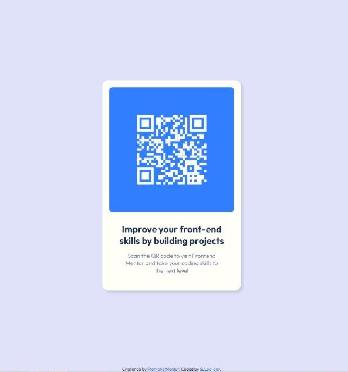

# Frontend Mentor - QR code component solution

This is a solution to the [QR code component challenge on Frontend Mentor](https://www.frontendmentor.io/challenges/qr-code-component-iux_sIO_H). Frontend Mentor challenges help you improve your coding skills by building realistic projects.

## Table of contents

- [Overview](#overview)
  - [Screenshot](#screenshot)
  - [Links](#links)
- [My process](#my-process)
  - [Built with](#built-with)
  - [What I learned](#what-i-learned)
- [Author](#author)

## Overview

### Screenshot

### Links

- Solution URL: [Click Here](https://www.frontendmentor.io/solutions/qr-code-component-using-html-and-css-5A039wlzSi)
- Live Site URL: [Click Here](https://sulee-dev.github.io/QR-code-component/)

## My process

### Built with

- Semantic HTML5 markup
- CSS custom properties
- Flexbox

### What I learned

html과 css를 배운 후 처음으로 실습한 간단한 newbie 프로젝트 
외부 소스를 css 파일에 import하는 방법을 배움 
간단한 component를 만들 때 어떤 태그 구조로 설계를 할지 먼저 생각하고 작성을 해야 한다는 점을 배움 

## Author

- Website - [SuLee-dev](https://github.com/SuLee-dev/)
